███████████████████████████████████████████████████████████████

                CANPIXEL

         Interactive Worlds

███████████████████████████████████████████████████████████████

[][youtube]

Building games, software and music that explore
systems, creativity and unconventional ideas.

#### Discover [My Realms](www.CanPixel.com)

### Software Engineer. Indie Game Developer & Designer. Composer. Musician 🎸

- 🌱 Ideological Sorceror of The <a href='https://github.com/CanPixel/BadOptics'>Gamified Political Compass</a>
- 👯 Up for cool collaborations or web/game/app commissions! Let game genres bend!
- 🥅 Future: (Finally) make a new update for <a href='https://github.com/CanPixel/BadOptics'>Bad Optics!</a>
- ⚡ I play guitar, drums & bass as a professional musician as well. Check out [ZIGGURATH](https://open.spotify.com/artist/4jUYHcbMXtVkLlJbf2jY7x?si=OBKmJJ4PRmKfCMZ_1IgoWA)! 🎸🥁

### Connect with me

&nbsp;&nbsp;

&nbsp;&nbsp;

### Languages and Tools

 

 

---

### 📺 Apps I've Made

#### ÆTHER - Local AI Research Engine & Browser - [use-aether.web.app](https://use-aether.web.app)
#### CunAI - Ancient Sumerian linguistic search with modern semantic vector retrieval - [cunai.app](https://cunai.app)

---

### 📺 Latest YouTube Videos

<!-- YOUTUBE:START -->
- [BAD OPTICS - The IdeologyDex™](https://www.youtube.com/watch?v=K7EKYMtiSzc)
- [BAD OPTICS - Censoring!](https://www.youtube.com/watch?v=GkWwrgQaC9o)
- [LifeSentence [old version]](https://www.youtube.com/watch?v=TDY7mNOLW9U)
- [Frisking Ruins - Bullet Hell Survival](https://www.youtube.com/watch?v=7GolsRuCwL0)
- [Ohm My Lord! - Electronic Mishmash](https://www.youtube.com/watch?v=lHhNvLmckwM)
- [Chivalry Chef - Medieval Cooking Battle Royale](https://www.youtube.com/watch?v=FbSoWeMh10Y)
<!-- YOUTUBE:END -->

---

## ⚡ GitHub Scoreboard

[website]: https://canpixel.com
[youtube]: https://www.youtube.com/channel/@Cannemen
[instagram]: https://instagram.com/cannemen
[linkedin]: https://www.linkedin.com/in/canpixel/
